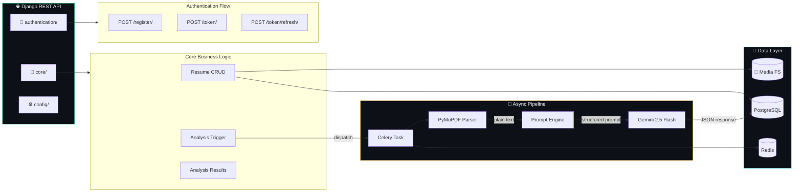
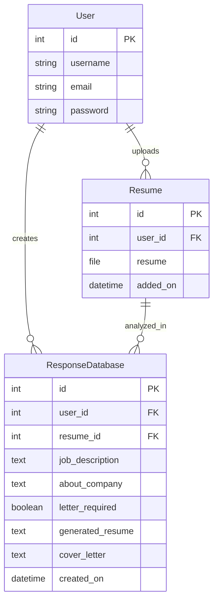
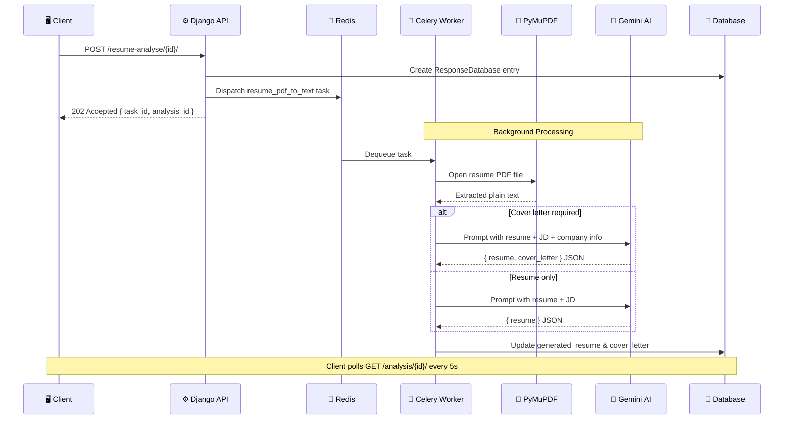

<p align="center">
  
  
  
  
  
  
</p>

<h1 align="center">⚙️ ResumeATS — Backend API</h1>

<p align="center">
  <strong>Django REST Framework API with Celery async processing and Google Gemini AI integration.</strong>
</p>

<p align="center">
  
  
  
  
</p>

---

## 🧠 What Does This Backend Do?

This is the **brain** of ResumeATS. It handles:

| Capability | How |
|---|---|
| 🔐 **User Authentication** | JWT-based auth via `djangorestframework-simplejwt` |
| 📄 **Resume Management** | File upload, storage, CRUD via DRF generic views |
| 🤖 **AI Resume Generation** | Google Gemini 2.5 Flash generates ATS-optimized content |
| 📝 **Cover Letter Generation** | Optional AI-generated cover letters tailored to company |
| ⚡ **Async Processing** | Celery + Redis — AI generation runs in background workers |
| 🗃️ **Data Persistence** | PostgreSQL (production) / SQLite (development) |

---

## 🏗️ Architecture Deep Dive



---

## 📁 Directory Structure

```
config/
├── 🔐 authentication/              # Auth module
│   ├── views.py                     # RegisterAPI (POST /register/)
│   ├── serializers.py               # UserGetSerializer, RegisterSerializer
│   └── urls.py                      # Auth routing
│
├── 📄 core/                         # Core business logic
│   ├── models.py                    # Resume, ResponseDatabase models
│   ├── views.py                     # 5 API views (List, Create, Detail, Analyse)
│   ├── serializers.py               # ResumeSerializer, ResumeUploadSerializer
│   ├── tasks.py                     # Celery task: resume_pdf_to_text
│   └── urls.py                      # Core routing
│
├── 🧠 intelligence/                 # AI engine
│   ├── ai.py                       # Gemini client initialization
│   ├── ai_prompt.py                 # Prompt templates for resume/cover letter
│   └── response.py                  # Response parsing (JSON extraction)
│
├── ⚙️ config/                       # Django project configuration
│   ├── settings.py                  # All settings (DB, JWT, Celery, CORS, etc.)
│   ├── urls.py                      # Root URL conf with JWT endpoints
│   ├── celery.py                    # Celery app initialization
│   ├── wsgi.py                      # WSGI entry point
│   └── asgi.py                      # ASGI entry point
│
├── 📜 requirements.txt              # Python dependencies
├── 🚀 render.yaml                   # Render.com deployment config
├── 🔨 build.sh                      # Build script (pip install + migrate)
├── ▶️ start.sh                      # Start script (Celery + Gunicorn)
├── 📋 .env.example                  # Environment variable template
└── 🗄️ manage.py                     # Django management CLI
```

---

## 📊 Data Models



---

## 🔌 API Endpoints

### 🔐 Authentication

| Method | Endpoint | Auth | Request Body | Response |
|:------:|----------|:----:|-------------|----------|
| `POST` | `/authentication/register/` | ❌ | `{ username, email, password }` | `201` — User created |
| `POST` | `/authentication/token/` | ❌ | `{ username, password }` | `200` — `{ access, refresh }` |
| `POST` | `/authentication/token/refresh/` | ❌ | `{ refresh }` | `200` — `{ access }` |

### 📄 Resume Management

| Method | Endpoint | Auth | Description |
|:------:|----------|:----:|-------------|
| `GET` | `/core/resume/` | ✅ | List all resumes for authenticated user |
| `POST` | `/core/resume/` | ✅ | Upload resume PDF (`multipart/form-data`) |
| `GET` | `/core/resume/{id}/` | ✅ | Get resume detail |
| `PUT` | `/core/resume/{id}/` | ✅ | Update resume |
| `DELETE` | `/core/resume/{id}/` | ✅ | Delete resume |

### ✨ AI Analysis

| Method | Endpoint | Auth | Request Body | Response |
|:------:|----------|:----:|-------------|----------|
| `POST` | `/core/resume-analyse/{resume_id}/` | ✅ | `{ job_description, about_company, letter_required }` | `202` — `{ message, task_id, analysis_id }` |
| `GET` | `/core/analysis/` | ✅ | — | List all analyses |
| `GET` | `/core/analysis/{id}/` | ✅ | — | Analysis detail with generated content |

---

## ⚡ Async Processing Pipeline

The AI generation is **fully asynchronous** via Celery:



---

## 🚀 Getting Started

### Prerequisites

```bash
python >= 3.10
redis-server        # For Celery broker
postgresql          # Optional (SQLite works for dev)
```

### Installation

```bash
# Clone and navigate
cd config/

# Create virtual environment
python -m venv venv
source venv/bin/activate        # Windows: venv\Scripts\activate

# Install dependencies
pip install -r requirements.txt

# Setup environment
cp .env.example .env
# Edit .env — add your GEMINI_API_KEY!

# Run migrations
python manage.py migrate

# Create admin user
python manage.py createsuperuser
```

### Run Services

```bash
# Terminal 1 — API Server
python manage.py runserver

# Terminal 2 — Celery Worker (requires Redis running)
celery -A config worker -l info
```

> 🟢 **API** → http://localhost:8000  
> 🔧 **Admin** → http://localhost:8000/admin/

---

## 🔑 Environment Variables

| Variable | Required | Description |
|----------|:--------:|-------------|
| `SECRET_KEY` | ✅ | Django secret key |
| `GEMINI_API_KEY` | ✅ | Google Gemini API key |
| `DATABASE_URL` | ❌ | PostgreSQL URL (defaults to SQLite) |
| `REDIS_URL` | ❌ | Redis URL (defaults to `redis://localhost:6379/0`) |
| `DEBUG` | ❌ | Enable debug mode (defaults to `False`) |
| `ALLOWED_HOSTS` | ❌ | Comma-separated hosts (defaults to `*`) |

---

## 🌐 Production Deployment (Render)

The included [`render.yaml`](./render.yaml) configures:

| Service | Type | Command |
|---------|------|---------|
| `resume-ats-generator` | Web | `gunicorn config.wsgi:application` |
| `celery-worker` | Worker | `celery -A config worker -l info` |
| `resume-ats-db` | PostgreSQL | Managed |
| `resume-ats-redis` | Redis | Managed |

```bash
# Deploy: connect GitHub repo → Render auto-detects render.yaml → done ✅
```

---

## 🔒 Security Features

- ✅ **JWT Authentication** — 30-minute access tokens, 7-day refresh tokens
- ✅ **CORS Headers** — Configurable cross-origin policy
- ✅ **Password Validation** — Django's built-in validators (min length, common, numeric, similarity)
- ✅ **User Isolation** — Each user can only access their own resumes and analyses
- ✅ **Environment Variables** — No secrets in source code

---

## 📦 Dependencies

| Package | Version | Purpose |
|---------|---------|---------|
| `Django` | ≥5.0 | Web framework |
| `djangorestframework` | ≥3.14 | REST API toolkit |
| `djangorestframework-simplejwt` | ≥5.3 | JWT authentication |
| `celery` | ≥5.3 | Async task queue |
| `redis` | ≥5.0 | Celery broker client |
| `google-genai` | ≥0.2.0 | Gemini AI SDK |
| `pymupdf` | ≥1.23 | PDF text extraction |
| `python-dotenv` | ≥1.0 | Environment variables |
| `dj-database-url` | ≥2.1 | Database URL parsing |
| `psycopg2-binary` | ≥2.9 | PostgreSQL adapter |
| `django-cors-headers` | ≥4.3 | CORS middleware |
| `gunicorn` | ≥21.2 | WSGI HTTP server |

---

<p align="center">
  <sub>Part of the <strong><a href="../README.md">ResumeATS</a></strong> project</sub>
</p>
